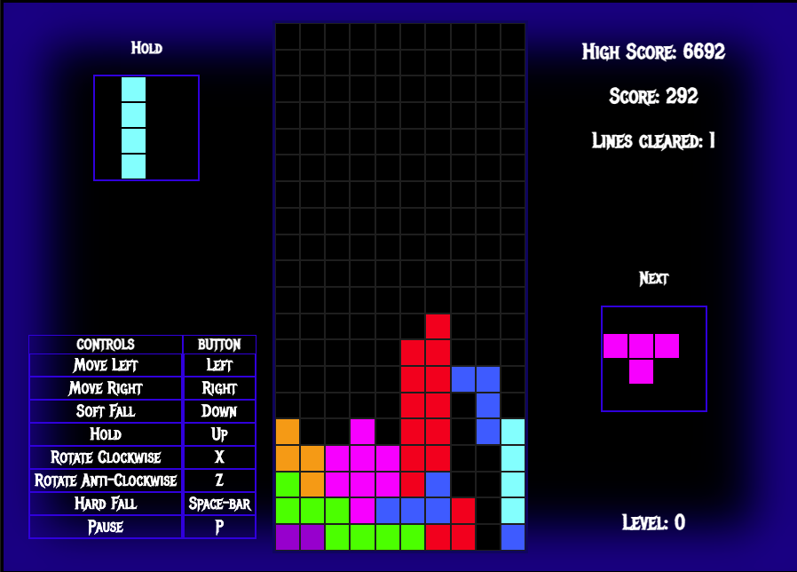

# Project 1: Building a game in JavaScript
By Dominic Reynolds

## Overview
---
We were given the task of creating a grid based game using HTML, CSS and vanilla Javascript. Out of the 9 choices, I decided that I wanted to make  Tetris. This was an individual project and we had one week to complete it, the three weeks before the project were for learning the fundamentals, and it was time to apply our new knowledge and make a game.

## Brief
---
The project brief:
* Render a game in the browser
* Use Javascript for DOM manipulation
* Design logic for winning & visually display when the player has won
* Include separate HTML / CSS / JavaScript files
* Deploy the game on GitHub pages

## Game Specifications
---
Tetris is a puzzle game where the player has to fit different shaped blocks (called Tetriminos) together so that they make a complete line across the playing board. Once a line is achieved it is removed from the game board and the player’s score is increased.

The player can move the Tetriminos left and right and rotate them clockwise in 90º increments.

The aim of the game is to get as many points as possible before the game board is filled with Tetriminos.

## Technologies Used
---
* HTML
* CSS
* JavaScript (ES6)
* VS Code
* Ableton Live 10 Suite
* Git
* GitHub Pages

## Approach Taken
---
### The Grid
I started out by creating the 10x20 grid. I achieved by using nested arrays containing objects. Each object contains a div, which I appended to the game screen. I also gave each cell a color (black by default) and a booelan value that would be used to tell if there was a Tetrimino has already been dropped into the cell (necessary for my collision logic later). Each cell was then pushed to an array of cells.

### Displaying the Tetriminos
The next step was to create the Tetriminos and display them on the game screen. I did this by creating an array containing the values necessary to construct each of the 7 Tetriminos. I made each choice an object, containing the shape (in the form of nested arrays of booleans) and the color. I then made a Tetrimino class that I would then use to construct every block. I added a method to the class called display, which would go through each of the boolean values in the shape array and using a nested forEach it would change the background color of the cells that the shape was to be displayed in.


### Rotation
To rotate the Tetriminos, I made each shape a square of booleans. I then changed the values in the nested array to rotate the piece.  I then removed it from the screen and displayed it again using the display method I mentioned above. I included a check to see if the piece could rotate. I used event listeners on the ‘X’ and ‘Z’ keys to rotate clockwise and anti-clockwise respectively. (I misspelled ‘Tetrimino’ throughout the code… Oops)
```JavaScript
rotate(isClockwise) {
    const newShape = []
    let canRotate = true
    for (let i = 0; i < this.width; i++) {
      newShape.push([])
    }
    if (isClockwise) {
      this.shapeArray.nestedForEach((cell, i, j) => {
        if (cell && j + this.y >= 19 || (this.y + (this.width - 1 - i) > 0 && cells[this.x + j] && cells[this.x + j][this.y + (this.width - 1 - i)].hasTetromino)) {
          canRotate = false
        } else if (cell && i + this.x >= 10) {
          this.moveSideways(-1)
        } else if (cell && i + this.x < 0) {
          this.moveSideways(1)
        }
        newShape[j].unshift(this.shapeArray[i][j])
      })
    } else {
      this.shapeArray.nestedForEach((cell, i, j) => {
        if (cell && j + this.y >= 19 || (this.y + i > 0 && cells[this.width - 1 - j + this.x] && cells[this.width - 1 - j + this.x][this.y + i].hasTetromino)) {
          canRotate = false
        } else if (cell && i + this.x >= 10) {
          this.moveSideways(-1)
        } else if (cell && i + this.x < 0) {
          this.moveSideways(1)
        }
        newShape[this.width - 1 - j].push(this.shapeArray[i][j])
      })
    }
    if (canRotate) {
      this.shapeArray = newShape
    }
  }
```

### Dropping the Tetriminos
I used Math.random() to construct a new Tetrimino at the start of the game, to make it fall down I created a method called drop() in the Tetrimino class which increments the y value of the Tetrimino and then displays it again. By using setTimeout in my playGame() function and calling itself again, I was able to get the Tetrimino to fall down at a steady rate. I used a speed variable that gets faster at the end of each level.

```JavaScript
function playGame() {
  if (!gameData.isGameOver && !gameData.isPaused) {
    const newTet = gameData.tetrominos[gameData.currentTetromino].drop()
    if (newTet) {
      gameData.r = Math.floor(Math.random() * 7)
      gameData.tetrominos.push(new Tetromino(tetrominoChoices[gameData.r].shapeArray, tetrominoChoices[gameData.r].color))
      checkTetris()
      gameData.currentTetromino++
    }
    gameData.tetrominos[gameData.currentTetromino + 1].displaySmall(nextCells)
    if (gameData.hardFall) {
      playGame() 
    } else if (gameData.softFall) {
      setTimeout(() => {
        playGame()
      }, 50) 
    } else {
      setTimeout(() => {
        playGame()
      }, gameData.speed) 
    }
  }
}
```

### Moving Sideways
To move sideways I added a method to the class that would either increase the x value by 1 or decrease it by 1, and then display the shape again. I included a check to make sure that the Tetrimino could move. I used event listeners, this time on the left and right arrow keys. Again I used a nested forEach loop for this, and I had plans to create a new array function to do this for me.

### Collision Detection
Every time a Tetrimino is dropped by one cell, there has to be a check to see if the cells below contain previous Tetriminos or if it is at the bottom of the grid. To do this I used the hasTetrimino boolean in the cells array that I mentioned above. I used another nested forEach to check if the cells below contained an old Tetrimino and the method would returns true if there is a collision. I also used this method to check if the game is over, by checking after discovering there is a collision, if the y value is smaller than zero. Additionally, after a collision, the hasTetrimino value of the cells containing the current Tetrimino would be changed to true, for future collision detection.
```JavaScript
 collisionDetection() {
    let hasCollided = false
    this.shapeArray.nestedForEach((cell, i, j) => {
      if (!(!cell || this.y + i < 0) && (cell === true && (this.y + i === 19 || cells[this.x + j][this.y + i + 1].hasTetromino))) {
        hasCollided = true 
        gameData.hardFall = false
      }
    })
    if (hasCollided) {
      elements.collision.play()
      if (this.y < 0) {
        gameOver()
      } else {
        updateScore(18)
      }
      this.shapeArray.nestedForEach((cell, i, j) => {
        if (cell) cells[this.x + j][this.y + i].hasTetromino = true
      })
    }
    return hasCollided
  }
```
### Full Row Removal
To check whether there was a full row completed i created the checkTetris function, in this function I had to check the hasTetrimino property of every cell in each of the 20 rows. If every cell in a row was true, then I had to remove the row. I couldn’t use my nested ForEach for this, as I had to iterate backwards through the y values. I started by inputing the row that had to be removed when I called the removeRow() function from inside checkTetris(), then it would go through the cells, removing the row and them changing the properties of all the cells in each row to be equal to the cell above them (this is why I had to iterate backwards) . 

### Scoring and Levels
By this point i had a working (but buggy) game of Tetris, so I needed to the scoring system, I started this by creating an updateScore() function, that would take a number as an input. Inside this function, the score would be updated using a level multiplier. I also added a level check function, that would run each time there was a row removed. Every 10 rows removed, the level would increase, and so would the speed of the game.

### The Small Displays
I made two small displays on screen, to display the next Tetrimino and to show the one that is held (the hold functionality came later). To make these small displays, I created a small 4x4 grid using my smallDisplay() function. This function takes two arguments; the div that is to be appended to, and the array of cells that is to be pushed to. To display the Tetriminos, I would change the background color of these cells accordingly. 

### Refactoring 
I initially had all of my game data set as global variables (mostly lets), when it came time to start a new game again I would refresh the page using location.reload(). However this was not the way I wanted to do it and I wanted to add a newGame() function that would reset all of these global variables. Initially I just copy and pasted the global variables into this function and then removed the keywords, but I wan’t happy because there was a lot of repetition. Instead of this I decided to declare an empty object called gameData, and in my new game function I added keys and values to the object. This way I no longer needed to reset 15 global variables at the start of a new game. I just had to call the function again and it would change the values in the object. After this I had to update the DOM, reset the game screen and the small displays. Finally, I called my playGame() function, to get the game started. It was in this stage that I created my nestedForEach() array callback function to simplify the repeated code throughout.
```JavaScript
 collisionDetection() {
    let hasCollided = false
    this.shapeArray.nestedForEach((cell, i, j) => {
      if (!(!cell || this.y + i < 0) && (cell === true && (this.y + i === 19 || cells[this.x + j][this.y + i + 1].hasTetromino))) {
        hasCollided = true 
        gameData.hardFall = false
      }
    })
    if (hasCollided) {
      elements.collision.play()
      if (this.y < 0) {
        gameOver()
      } else {
        updateScore(18)
      }
      this.shapeArray.nestedForEach((cell, i, j) => {
        if (cell) cells[this.x + j][this.y + i].hasTetromino = true
      })
    }
    return hasCollided
  }
```
```JavaScript
Array.prototype.nestedForEach = function(callback) {
  this.forEach((e, i) => e.forEach((e2, j) => {
    return callback(this[i][j], i, j)
  }))
}
```


 
### Future Additions
* With more time I would make the game mobile friendly.
* Storing high scores in a back end rather than local storage so that players can compete. 

### Key Learnings
This project really helped with my problem solving and debugging, as most of my time was spent fixing bugs to ensure that the game worked smoothly and as close to the original game as I could get, which I believe I achieved well. I was very pleased that I planned out how I would build the game before I started as without the planning, I would have not had finished with a complete product.
